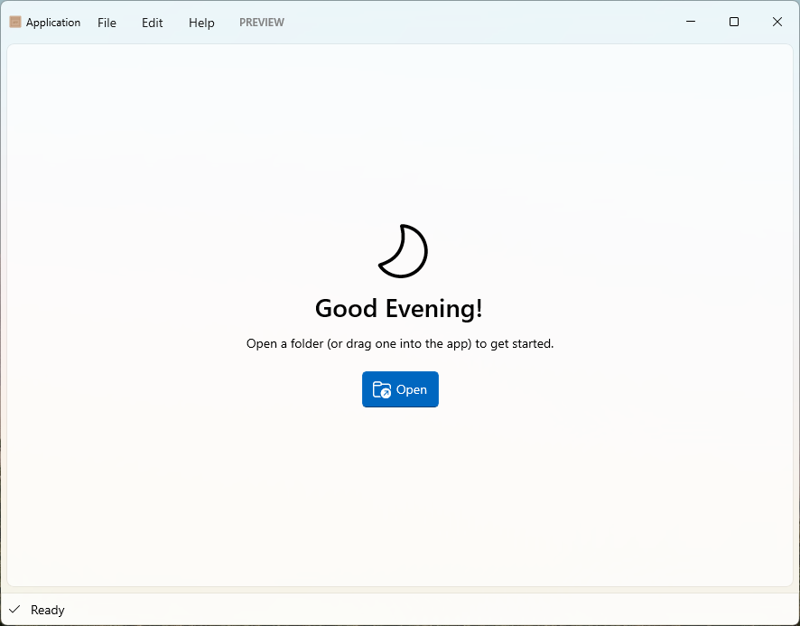
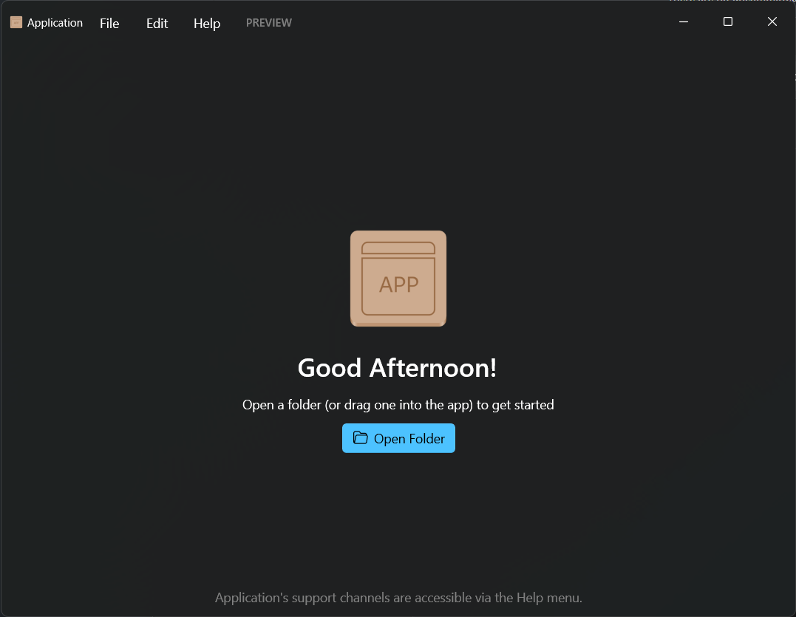

# Application

 **A template for creating Nickvision applications**

# Features
- A cross-platform C# application
  - Windows UI in Windows App SDK (WinUI 3)
  - GNOME UI in gir.core (Gtk4/Libadwaita)

# Chat

# Translating
Everyone is welcome to translate this app into their native or known languages, so that the application is accessible to everyone.

## Manually
To start translating the app, fork the repository and clone it locally.

In the `NickvisionApplication.Shared/Resources` folder you will see a file called `String.resx`. This is a C# resource file that contains all the strings for the application. Simply copy that file and rename it `String.<lang-code>.resx`. For example, if I'm creating an Italian translation, the copied file would be called `Strings.it.resx`. Once you have your copied file, simply replace each `<value>` block of each `<data>` string block with your language's appropriate translation.

To check your translation file, make sure your system is in the locale of the language you are translating and run the app. You should see your translated strings!

Once all changes to your translated file are made, make sure the file is in the path `NickvisionApplication.Shared/Resources/String.<lang-code>.resx` and commit these changes.

Even if you're running Windows, we ask you to also translate metadata for GNOME (Linux) version of the app. There are 2 places that require changes when a new translation is added:
- `NickvisionApplication.GNOME/org.nickvision.application.desktop`: `Comment[lang-code]` line
- `NickvisionApplication.GNOME/org.nickvision.application.metainfo.xml`: `<description>` section

When you're done, create a pull request to the project.

# GNOME Screenshots

# WinUI Screenshots

# Dependencies
- [.NET 7](https://dotnet.microsoft.com/en-us/)

# Code of Conduct

This project follows the [GNOME Code of Conduct](https://wiki.gnome.org/Foundation/CodeOfConduct).
