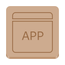

# Application


 **Create new Nickvision applications**

## Features
- A template for creating cross-platform desktop apps with [Tauri](https://tauri.app) (Rust backend) and a React/TypeScript frontend
    - Windows support
    - macOS support
    - Linux support (via Flatpak)

## Chat
<a href='https://matrix.to/#/#nickvision:matrix.org'></a>

## Contributing

See [CONTRIBUTING.md](CONTRIBUTING.md) for details on how can you help the project and how to provide information so we can help you in case of troubles with the app.

## Building

Application is a [Tauri](https://tauri.app) project (Rust backend, React/TypeScript frontend) and can be built on Windows, macOS, and Linux. The following are required system dependencies for building the project:

- [Node.js](https://nodejs.org/) (LTS)
- [Rust](https://www.rust-lang.org/tools/install) (stable toolchain)
- [gettext](https://www.gnu.org/software/gettext/)
    - Can be installed on Windows using `msys2`
    - Can be installed on macOS using `brew install gettext`

Once all dependencies are available on the system, run:

```
npm install
npm run tauri dev
```

to run the app in development mode, or:

```
npm install
npm run tauri build
```

to build a release bundle for your platform.

## Installing

### Windows
The recommended method is to use the pre-built Windows installer from the Releases section.

However, you can also build an installer manually by running `npm run tauri build`, which produces an `.msi` installer under `src-tauri/target/release/bundle/msi`.

### macOS
The recommended method is to use the pre-built app from the Releases section.

However, you can also build the app manually by running `npm run tauri build`, which produces a `.app` bundle under `src-tauri/target/release/bundle/macos`. Note that this build is currently unsigned and unnotarized, so on first launch you will need to right-click the app and select "Open" to bypass Gatekeeper.

### Linux
The recommended method is to use the flatpak available on Flathub.

However, you can also build a flatpak of the app manually using the [flatpak manifest file](build-aux/org.nickvision.application.json).

You can also install the application locally from source using the [linux install script](resources/linux/publish-and-install.sh).

## Code of Conduct

This project follows the [GNOME Code of Conduct](https://conduct.gnome.org/).
