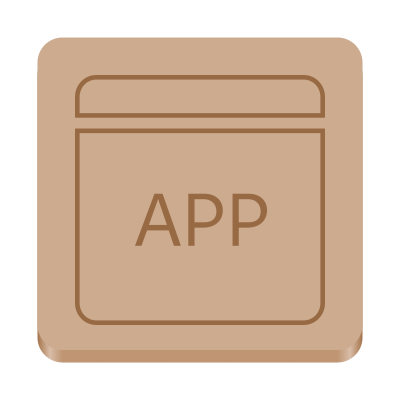

# Application

 **Create new Nickvision applications**

# Features
- A cross-platform C# application
  - Windows UI in Windows App SDK (WinUI 3)
  - GNOME UI in [gir.core](https://gircore.github.io/) (Gtk4/Libadwaita)

# Chat

# Contributing

See [CONTRIBUTING.md](CONTRIBUTING.md) for details on how can you help the project and how to provide information so we can help you in case of troubles with the app.

# GNOME Screenshots

# WinUI Screenshots

# Dependencies
- [.NET 7](https://dotnet.microsoft.com/en-us/)

# Code of Conduct

This project follows the [GNOME Code of Conduct](https://wiki.gnome.org/Foundation/CodeOfConduct).
